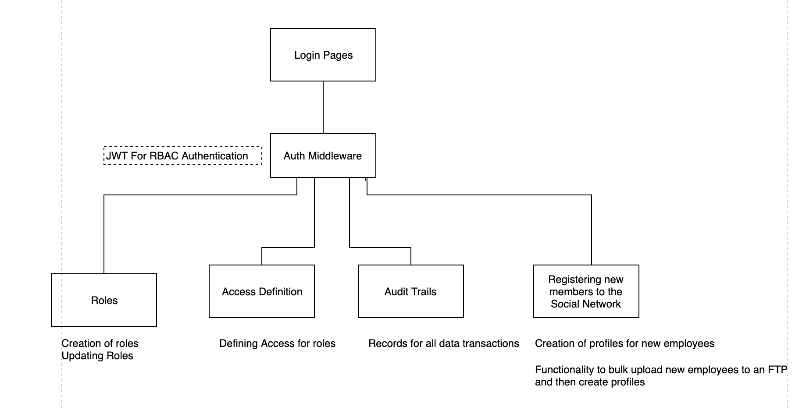
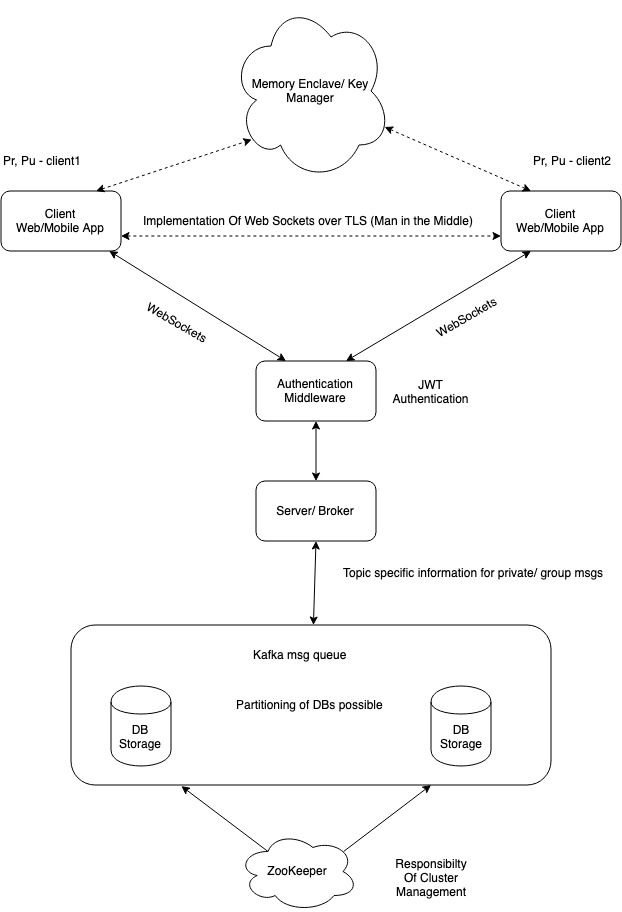
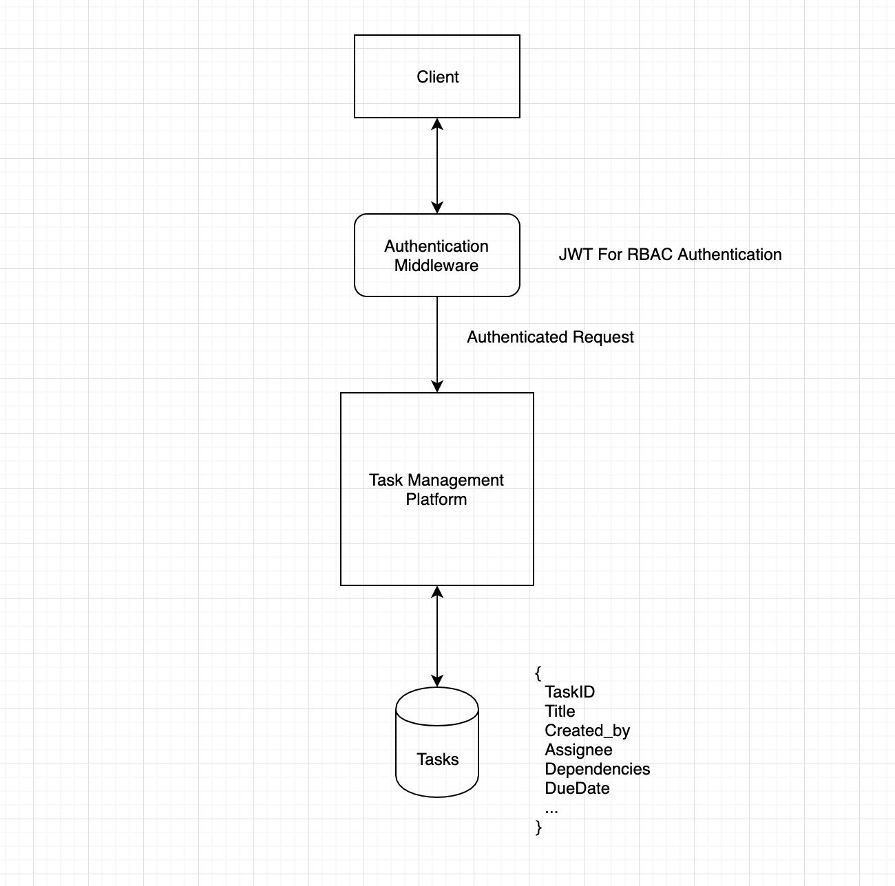

# KSP-IPH-2019-Table23
LegionBridge - An app that bridges communication gaps in the police dept.

# Why is the problem worth solving?

```
Bridging communication gaps is of highest importance in the service sector, especially police department. There are different modes of communication that the Police use primarily like Walkie-Talkies, Emails and Phone calls which raises the need for a Single Communication Platform that covers sharing of all types of media from Text to Videos and even have features for Audio/Video Conferencing,  Location Sharing.
```

# Explain how you would build your product within the 36 hours and explain in detail the architecture?

```
The backend of the application will be programmed in Go. For the messaging platform Kafka (confluent-kafka-go)will be used as the Messaging Streaming System. The backend servers will be implemented as microservices which would be deployed as Docker containers on Kubernetes.
Frontend of the application will be implemented using React and Web Sockets for the Chat App.
```
## Server admin platform

## Chat app kafka golang

## Task Management app



